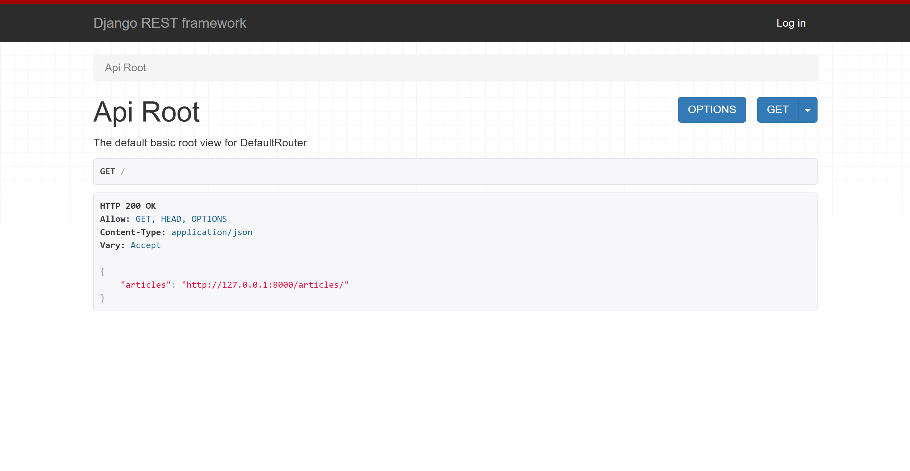
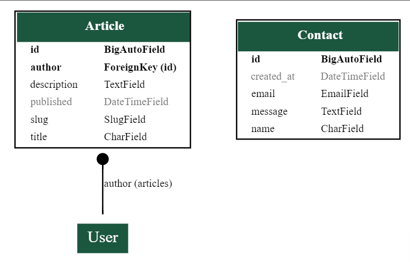
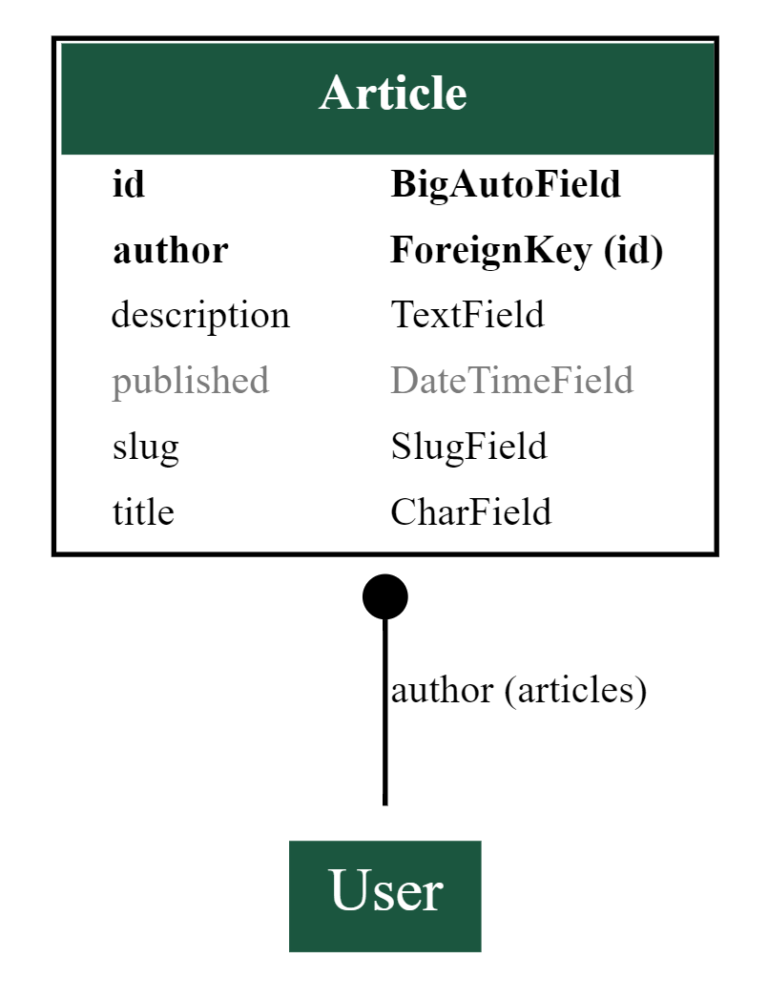
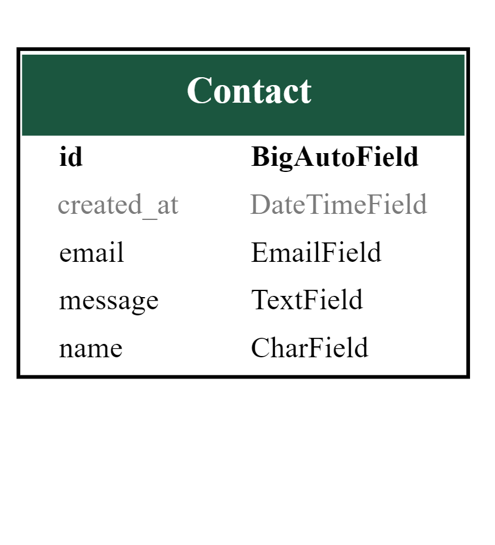
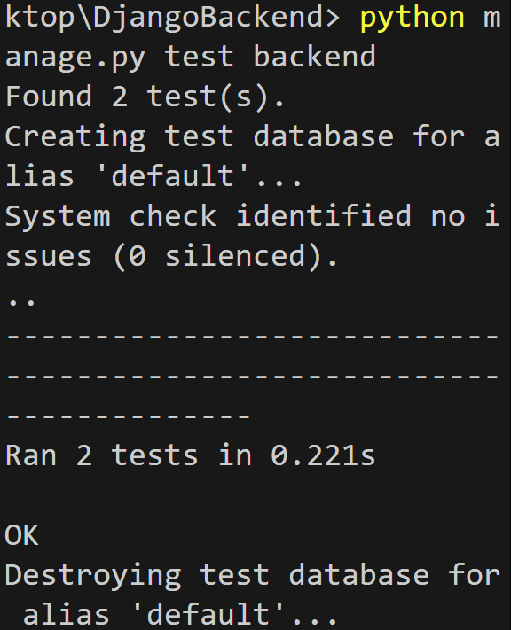
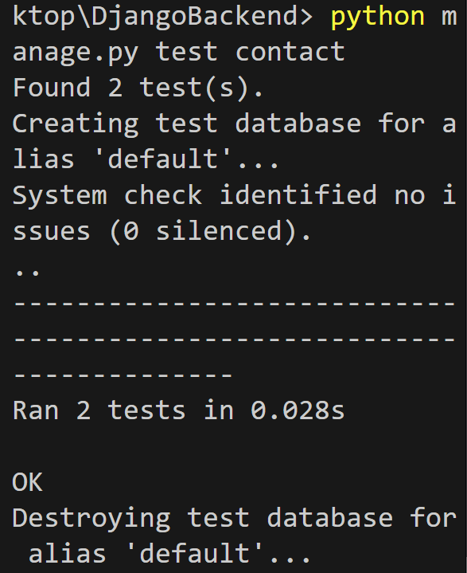

# Blog - Backend

## Introduction



Welcome to my RESTful API, created for my frontend React application, Blog.

The API is live at: [Blog back-end](https://djrest-f-bfd9b0bcf48e.herokuapp.com/)

You can explore the front-end code for this API on GitHub: [Blog front-end](https://github.com/fgit-24/pp5-frontend),

And the deployed front-end can be accessed here: [Blog](https://frontend-f-2bf7aea4b103.herokuapp.com/)

This API encompasses all the necessary logic that enables users to perform CRUD operations on the frontend.

Blog serves as a Blog where users can write articles and share their thoughts.

The site features a contact page and user registration and login.


## Table of Contents

- [Blog - Backend](#blog---backend)
  - [Introduction](#introduction)
  - [Table of Contents](#table-of-contents)
  - [Design](#design)
    - [Entity Relational Diagram Article and Contact](#entity-relational-diagram-article-and-contact)
    - [Entity Relational Diagram Article and Contact](#entity-relational-diagram-article-and-contact-1)
    - [Entity Relational Diagram Article and Contact](#entity-relational-diagram-article-and-contact-2)
  - [Testing](#testing)
      - [Integration Tests backend](#integration-tests-backend)
      - [Integration Tests contact](#integration-tests-contact)
    - [Validation](#validation)
    - [Manual Testing](#manual-testing)
      - [root\_route](#root_route)
      - [articles](#articles)
      - [Contact](#contact)
  - [Deployment](#deployment)
    - [Cloning and Forking](#cloning-and-forking)
  - [Technologies Used](#technologies-used)
    - [Languages](#languages)
    - [Frameworks](#frameworks)
    - [Libraries](#libraries)
      - [Authentication](#authentication)
      - [Database](#database)
      - [Utilities](#utilities)
    - [Deployment Service](#deployment-service)
  - [Bugs](#bugs)
    - [Fixed Bugs](#fixed-bugs)
  - [Credits](#credits)

## Design

### Entity Relational Diagram Article and Contact




### Entity Relational Diagram Article and Contact




### Entity Relational Diagram Article and Contact



In my design phase, I mapped out my models using a spreadsheet.

The models allow the creation, reading, updating and deleting of articles.

I've also built a contact model.


## Testing

#### Integration Tests backend



#### Integration Tests contact




### Validation

All files that I created or modified were checked using the [PEP8 CI python linter](https://pep8ci.herokuapp.com/), with no errors or warnings found.

### Manual Testing

Every item listed under "Works" was manually tested, and marked with an X for yes if it functions correctly, or no if it does not.

#### root_route

| Works                    |  YES  | NO  |
| ------------------------ | :---: | --- |
| The root_route URL loads |   X   |     |


#### articles

| Works                                                     |  YES  | NO  |
| --------------------------------------------------------- | :---: | --- |
| `articles/` is accessible if not logged in                |   X   |     |
| `articles/<int:pk>/` isn't accessible if not logged in    |   X   |     |
| If I am signed in, I can add a article                    |   X   |     |
| articles can not be edited if not logged in as the owner  |   X   |     |
| articles can not be deleted if not logged in as its owner |   X   |     |
| articles can be edited by its owner                       |   X   |     |
| articles can be deleted by its owner                      |   X   |     |


#### Contact

| Works                                                          |  YES  | NO  |
| -------------------------------------------------------------- | :---: | --- |
| `contact/` is accessible without logging in                    |   X   |     |
| `contact form/`                                                |   X   |     |
| Feedback message when successfully sending the contact message |   X   |     |


## Deployment


On [Heroku](https://www.heroku.com/), I created my app. In the app's settings page, I added the following configuration variables:


- **SECRET_KEY** with a value obtained from [Djecrety](https://djecrety.ir/).
- - **DEBUG** with the value False.


I installed `decouple` and stored my secret key and debug mode in a seperate `.env` file.

The value for `DEBUG` is set to False.

enabling a seamless switch between development and production environments.

Temporarily comment out the DEV variable in the env.py file to allow the IDE to connect to the external database.

In settings.py, insert a print statement here:


Then, run the following command in your terminal:

- ```python3 manage.py makemigrations --dry-run```

Proceed to migrate the database:

- ```python3 manage.py migrate```

To create a superuser, run:

- ```python3 manage.py createsuperuser```


Finally, click "Execute", and you should see your superuser listed.

Back in the IDE, I installed gunicorn and django-cors-headers using the following command:

- ```pip3 install gunicorn django-cors-headers```

Gunicorn is necessary for deploying to Heroku, and we need django-cors-headers

since the frontend and backend will be hosted on different domains.

To save the installed packages to requirements.txt, run:

pip freeze --local > requirements.txt
Create a Procfile in the root directory, and add the following content:

- ```pip freeze --local > requirements.txt```

Create a Procfile in the root directory, and add this inside:

```
release: python manage.py makemigrations && python manage.py migrate
web: gunicorn <your-project-name>.wsgi
```

I implemented this after my first deployment.

but with the deployed URL now available, I returned to my app on Heroku, navigated to settings, revealed config vars, and entered ALLOWED_HOST with the value of my deployed URL.

Back in the IDE, I added 'corsheaders' to INSTALLED_APPS.

I also added 'corsheaders.middleware.CorsMiddleware', to the top of the MIDDLEWARE list in settings.py.

Continuing in settings.py, we need to establish some allowed origins for CORS

to ensure network requests aren’t blocked. Note that this code is tailored specifically for use with GitPod

and may require different configurations for your setup.

```
CORS_ORIGIN_ALLOW_ALL = True
```

Ensure that you replaced your SECRET_KEY with something similar to this:

```SECRET_KEY = config('SECRET_KEY')```, and make sure to set a new value for it

in `env.py` or another secure file that you won't push to a public repository.

I added this to my `env.py`: ```os.environ.setdefault("SECRET_KEY = config('SECRET_KEY')```

I modified the `DEBUG` setting in `settings.py` to: ```DEBUG = config('DEBUG', default=False, cast=bool)```,

which makes it easier to avoid toggling `DEBUG` between True and False during development.

Next, I uncommented the `DEV` line in `env.py`.

Again, I verified that my `requirements.txt` was up-to-date, and then pushed the changes to GitHub.

On Heroku, open the deploy tab for the app, select "Connect to GitHub",

search for the repository, and click connect.

Finally, click "Deploy Branch". Once the build process completes, your app should open and function as expected.

### Cloning and Forking

If you wish to clone or fork this project, you can do so from my [GitHub repository](https://github.com/fgit-24/pp5-djrest).

It's advisable to set up a virtual environment first.

**Cloning** the project allows you to create a local copy of the project on your machine,

enabling you to make modifications without affecting the original repository.

**Forking** it creates a copy of the project in your own GitHub account,

allowing you to propose changes to the original project 

or develop your modified version of it.

Next, you will need to reinstall the dependencies listed in the `requirements.txt` file using:

- ```pip install -r requirements.txt```

You will also have to configure your own environment variables.

## Technologies Used

### Languages

This API was developed using Python.

### Frameworks

- Django
  
  The primary framework that serves as the foundation for this API.

- django-rest-framework
  
  A framework built on top of Django, used for crafting RESTful APIs.

### Libraries

#### Authentication

- dj-rest-auth
  
  Enables `django-rest-framework` to provide authentication endpoints easily.

- django-allauth
  
  A comprehensive authentication application for Django.

- djangorestframework-simplejwt
  
  JSON Web Token-based authentication, which will be utilized for authentication from the frontend.

#### Database

- db.sqlite3


#### Utilities

- gunicorn
  
  A WSGI server used in production, necessary for deployment.

- django-cors-headers
  
  Adds Cross-Origin Resource Sharing headers to allow requests to a Django application from other origins.


### Deployment Service

The project was deployed using [Heroku](https://www.heroku.com/).

## Bugs

While developing the ArticleViewSet, you encountered an issue where users who are not the authors of an article were still able to view or edit articles that they did not create. The permissions were not properly restricting access to only the article authors, which was a critical issue for maintaining data integrity and ensuring that users could only modify their own content.

### Fixed Bugs

Permissions Configuration:

Ensure that the IsAuthenticated permission is in place to require that users are logged in.
Introduce a custom permission (IsAuthor) to restrict write access to the authors only.
Custom Permission Implementation (IsAuthor):

The IsAuthor permission checks if the current user is the author of the article based on a author field in the Article model.


## Credits

I want to thank Code Institute, it's been an amazing journey, and I've learned a lot!